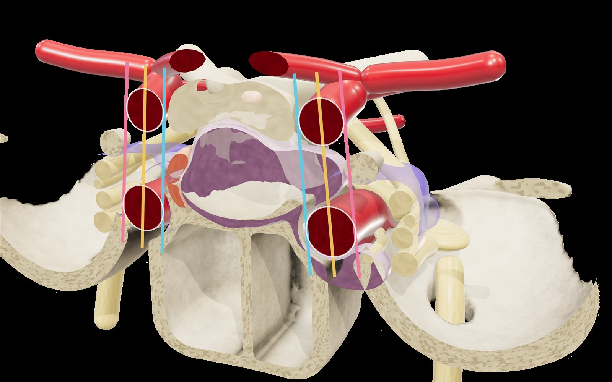
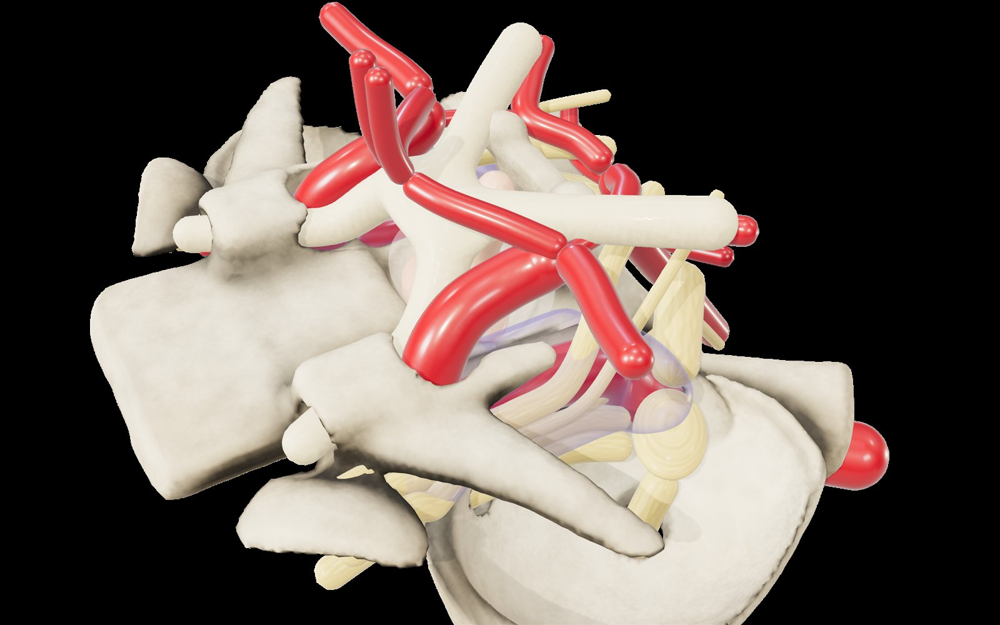
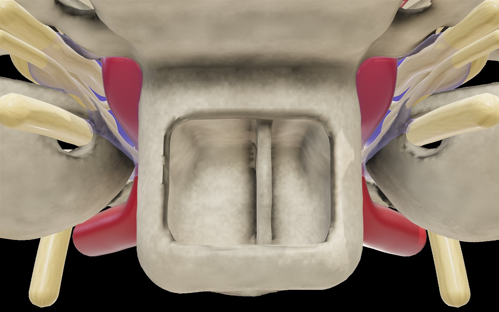
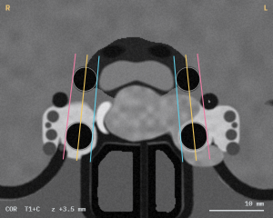

# Knosp Sellar Atlas

**Türkçe** · [English](#english)

Hipofiz adenomlarında (PitNET) kavernöz sinüs uzanımını değerlendiren **Knosp sınıflamasını** ve ilgili sellar/parasellar anatomiyi anlatan, tarayıcıda çalışan etkileşimli bir 3B ders. Three.js ile yazıldı; Türkçe ve İngilizce arasında tek tıkla geçilebilir.

**▶ Canlı sürüm: [opisthion06.github.io/knosp-sellar-atlas](https://opisthion06.github.io/knosp-sellar-atlas/)**. Kurulum gerekmez, tarayıcıda açılır.



| Genel görünüm | Endonazal perspektif | Sentetik koronal T1+C MR |
|---|---|---|
|  |  |  |

## Özellikler

- **15 adımlı ders:** sellar bölge, sella turcica ve sfenoid kemik, endonazal perspektif, hipofiz–sap–diafragma, kavernöz sinüs, karotis sifonu (Bouthillier C2–C7), kraniyal sinirler, koronal kesit ve Knosp çizgileri, derece 0 / 1 / 2 / 3A / 3B / 4 ve klinik önem.
- **Anatomi:** sfenoid gövde ve sinüs (sfenoidotomi, septum, sellar kabarıklık, karotis çıkıntısı), anterior ve posterior klinoidler, dorsum sellae, klivus, petröz apeks, orta kraniyal fossa, optik kanal, foramen rotundum ve ovale; ön ve arka lob, sap, diafragma sella; optik sinir, kiazma ve trakt; ICA, oftalmik arter, PCom, A1/A2, AComm, MCA, baziler arter, PCA, SCA; III, IV, V1, V2, V3, VI, trigeminal kök ve Gasser ganglionu; yarı saydam kavernöz sinüs.
- **Knosp derecelendirmesi:** koronal kesit düzlemi kaydırılabilir; medial tanjant, interkarotid çizgi ve lateral tanjant o kesitteki ICA kesitlerinden hesaplanır. Dereceler arasında tümör şekil değiştirir; 3A/4'te lateral duvar sinirleri itilir, 3B'de VI. sinir sarılır.
- **Sentetik MR:** aynı kesitin koronal T1 kontrastlı görüntüsü, Knosp çizgileriyle birlikte. Pencere sürüklenebilir, boyutlandırılabilir ve küçültülebilir; açıkken 3B sahne pencerenin olmadığı tarafa kayar.
- **Etkileşim:** döndürme, yakınlaştırma, kaydırma; tıklayınca yapı bilgisi, çift tıklayınca odaklanma; katmanlar ve kemik opaklığı; hazır görünümler.
- **Kendini sına:** rastgele vakada derece tahmini ve açıklamalı geri bildirim.

## Çalıştırma

Kurulum gerekmez. Three.js ve three-mesh-bvh CDN'den (jsDelivr) yüklendiği için internet bağlantısı gerekir.

- **Windows:** `Knosp Atlasi.bat` dosyasına çift tıklayın. Küçük bir yerel sunucu başlatır ve sayfayı tarayıcıda açar ([Node.js](https://nodejs.org) gerekir).
- **Herhangi bir sistem:**
  ```bash
  node sunucu.js
  ```
  veya başka bir statik sunucu, örneğin `npx http-server . -p 8080`, sonra `http://127.0.0.1:8080`.
- Tam ekran için tarayıcıda **F11**.

Açılışta model tarayıcıda hesaplandığı için birkaç saniyelik yükleme ekranı normaldir.

## Proje yapısı

```
index.html          Derlenmiş tek dosyalık uygulama (doğrudan açılır)
src/head.html       <title>, fontlar ve CSS
src/markup.html     Arayüz iskeleti ve script yer tutucuları
src/core.js         SDF anatomi: kemik, ICA, sinirler, kavernöz sinüs, tümör durumları, Knosp çizgileri
src/content.js      İki dilli içerik (TR/EN): ders adımları, yapı açıklamaları, arayüz metinleri
src/app.js          Three.js sahnesi, malzemeler, surface nets, sentetik MR, etkileşim
tools/build.js      src/ → index.html
sunucu.js           Yerel statik sunucu (tarayıcıyı da açar)
```

`src/` altında değişiklik yaptıktan sonra:

```bash
node tools/build.js
```

## Nasıl yapıldı

Hazır bir 3B model kullanılmadı. Anatomi, literatürdeki ortalama ölçülere göre milimetre ölçeğinde **işaretli uzaklık alanları (SDF)** ile tanımlanır ve **surface nets** ile ağa dönüştürülür. Damarlar ve sinirler değişken yarıçaplı tüpler olarak üretilir. Gerçekçilik için fiziksel malzemeler (nemli damar yüzeyi, lifli sinir dokusu), kemikte SDF tabanlı ortam gölgelemesi ve kesit yüzeylerinde trabeküler desen kullanılır. Her tümör durumunun koronal kesitlerde gerçekten kendi Knosp bölgesine düştüğü sayısal olarak test edildi.

## Kaynaklar

- Knosp E, Steiner E, Kitz K, Matula C. Pituitary adenomas with invasion of the cavernous sinus space: a magnetic resonance imaging classification compared with surgical findings. *Neurosurgery*. 1993;33(4):610–618.
- Micko ASG, Wöhrer A, Wolfsberger S, Knosp E. Invasion of the cavernous sinus space in pituitary adenomas: endoscopic verification and its correlation with an MRI-based classification. *J Neurosurg*. 2015;122(4):803–811.
- Radiological Knosp, Revised-Knosp, and Hardy–Wilson classifications for the prediction of surgical outcomes in the endoscopic endonasal surgery of pituitary adenomas: study of 228 cases. [PMC8810816](https://pmc.ncbi.nlm.nih.gov/articles/PMC8810816/)
- Automated assessment of Knosp grade from pituitary adenoma MRI. [PMC13262174](https://pmc.ncbi.nlm.nih.gov/articles/PMC13262174/)
- Bouthillier A, van Loveren HR, Keller JT. Segments of the internal carotid artery: a new classification. *Neurosurgery*. 1996;38(3):425–433.
- Morphological analysis of the cavernous segment of the internal carotid artery. [PMC12691409](https://pmc.ncbi.nlm.nih.gov/articles/PMC12691409/)
- Rhoton AL Jr. The sellar region. *Neurosurgery*. 2002;51(4 Suppl):S335–S374.

## Uyarı

Bu proje eğitim amaçlıdır. Model şematik-gerçekçidir ve tek bir hastanın anatomisini temsil etmez; MR görüntüsü sentetiktir. Klinik karar için kullanılmamalıdır. Tümör **sol** tarafta derecelendirilir (radyolojik düzende ekranın sağı).

## Lisans

[](https://creativecommons.org/licenses/by/4.0/)

Bu çalışma [Creative Commons Atıf 4.0 Uluslararası (CC BY 4.0)](https://creativecommons.org/licenses/by/4.0/deed.tr) lisansıyla sunulmaktadır. İndirebilir, kullanabilir, değiştirebilir, derslerde ve sunumlarda gösterebilir, ticari amaçla da dahil olmak üzere paylaşabilirsiniz. Tek şart **atıf** yapmanızdır: eser adını, yazarı ve bu depoya bağlantıyı belirtin, değişiklik yaptıysanız bunu da not edin.

Önerilen atıf:

> Knosp Sellar Atlas — opisthion06, https://github.com/opisthion06/knosp-sellar-atlas, CC BY 4.0

Çalışma sırasında CDN'den yüklenen üçüncü taraf kütüphaneler (three.js, three-mesh-bvh) bu esere dahil değildir ve kendi MIT lisanslarına tabidir. Tam metin: [LICENSE](LICENSE).

---

## English

An interactive, browser-based 3D lesson on the **Knosp classification** of cavernous sinus extension in pituitary adenomas (PitNETs) and the surrounding sellar/parasellar anatomy. Built with Three.js; switch between Turkish and English with one click.

**▶ Live version: [opisthion06.github.io/knosp-sellar-atlas](https://opisthion06.github.io/knosp-sellar-atlas/)**. Nothing to install; it runs in the browser.

### Features

- **15-step lesson:** the sellar region, sella turcica and sphenoid bone, endonasal perspective, pituitary gland–stalk–diaphragma, cavernous sinus, carotid siphon (Bouthillier C2–C7), cranial nerves, the coronal section and Knosp lines, grades 0 / 1 / 2 / 3A / 3B / 4, and clinical significance.
- **Anatomy:** sphenoid body and sinus (sphenoidotomy, septum, sellar bulge, carotid prominence), anterior and posterior clinoid processes, dorsum sellae, clivus, petrous apex, middle cranial fossa, optic canal, foramen rotundum and ovale; anterior and posterior lobes, stalk, diaphragma sellae; optic nerve, chiasm and tract; ICA, ophthalmic artery, PComm, A1/A2, AComm, MCA, basilar artery, PCA, SCA; CN III, IV, V1, V2, V3, VI, trigeminal root and Gasserian ganglion; translucent cavernous sinus.
- **Knosp grading:** the coronal section plane can be moved; the medial tangent, intercarotid line and lateral tangent are computed from the ICA cross-sections in that slice. The tumor morphs between grades; lateral-wall nerves are displaced in 3A/4, and CN VI is encased in 3B.
- **Synthetic MRI:** a coronal contrast-enhanced T1 image of the same slice with the Knosp lines. The window can be dragged, resized and minimized; while it is open, the 3D scene shifts away from it.
- **Interaction:** rotate, zoom, pan; click a structure for a description, double-click to focus; layer toggles and bone opacity; preset views.
- **Self-test:** grade a random case and get explained feedback.

### Running

No installation. Three.js and three-mesh-bvh load from a CDN (jsDelivr), so an internet connection is required.

- **Windows:** double-click `Knosp Atlasi.bat`. It starts a small local server and opens the page ([Node.js](https://nodejs.org) required).
- **Any system:** `node sunucu.js`, or any static server such as `npx http-server . -p 8080`, then open `http://127.0.0.1:8080`.
- Press **F11** for full screen.

The model is computed in the browser at start-up, so a loading screen of a few seconds is expected.

### Project structure

See the tree above. After editing files in `src/`, rebuild with `node tools/build.js`.

### How it was made

No prebuilt 3D model is used. The anatomy is defined as **signed distance fields (SDF)** on a millimeter scale, based on mean dimensions from the literature, and meshed with **surface nets**. Vessels and nerves are variable-radius tubes. Realism comes from physically based materials (wet vessel surfaces, fibrous nerve texture), SDF-based ambient occlusion on bone, and a trabecular pattern on cut surfaces. Each tumor state was tested numerically to fall within its own Knosp zone across the coronal slices.

### Disclaimer

For educational use only. The model is schematic-realistic and does not represent any individual patient; the MRI image is synthetic. Not intended for clinical decision-making. The tumor is graded on the **left** side (the right side of the screen in radiological convention).

### License

[](https://creativecommons.org/licenses/by/4.0/)

This work is licensed under the [Creative Commons Attribution 4.0 International License (CC BY 4.0)](https://creativecommons.org/licenses/by/4.0/). You may download, use, adapt, present in lectures and redistribute it, including commercially, as long as you give **attribution**: name the work and the author, link to this repository, and indicate if changes were made.

Suggested attribution:

> Knosp Sellar Atlas — opisthion06, https://github.com/opisthion06/knosp-sellar-atlas, CC BY 4.0

Third-party libraries loaded from a CDN at runtime (three.js, three-mesh-bvh) are not part of this work and remain under their own MIT licenses. Full text: [LICENSE](LICENSE).
